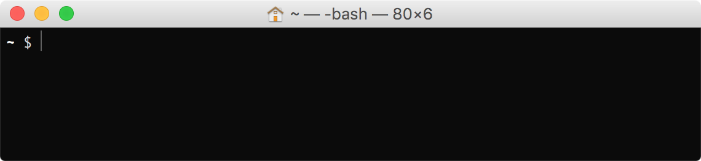
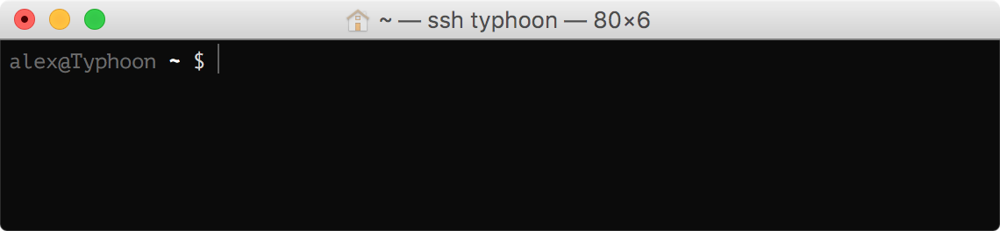

# xelabash



A few simple, no-nonsense, non-distracting additions to the standard bash prompt.

## Features

- Compact, minimalist, single-line prompt, featuring:
  - Red `$` (or `#`, if root) in prompt following an error
  - `user@hostname`, but only when in a remote session
  - Git branch and working copy dirty status, when in a Git repo
  - Active Kubernetes context and namespace
- "Better"-than-default autocomplete settings
- Not overly opinionated; designed to integrate with other settings and tools if desired 

## Install and Setup

Works best with bash 4.4+.

Clone this repo and symlink `.bash_profile` to your home folder. There are no dependencies to install.

```bash
cd
git clone --depth=1 https://github.com/aelindeman/xelabash.git .local/share/xelabash
ln -s .local/share/xelabash/.bash_profile
```

Xelabash will also source `.profile` and `.bash_aliases`, if you have them.

Git and Kubernetes prompt pieces are **opt-in.** Set `GIT_PROMPT=true` and/or `KUBE_PROMPT=true` in your `~/.profile` to activate them, or use a tool like [direnv](https://github.com/direnv/direnv) to do it conditionally based on your working directory.

## More pictures

- Full `cwd`

  

- Git status and branch

  

- Kubernetes context (and namespace, if set)

  

- Last process exit status

  

- Username and hostname, when connected via `ssh`

  

- ...and they all work in combination with each other

  
