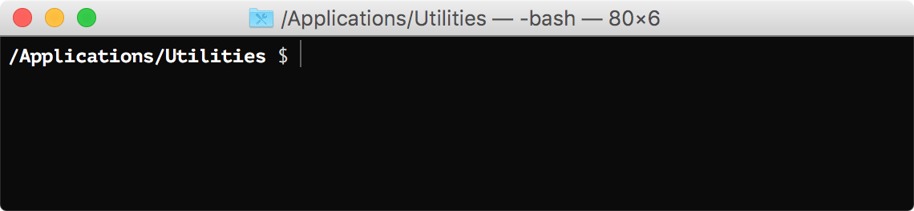

# xelabash


A few simple, no-nonsense, non-distracting additions to the standard bash prompt.

## Install

Works best with bash 4.4+.

Clone this repo and symlink `.bash_profile` to your home folder.

```bash
cd
git clone --depth=1 https://github.com/aelindeman/xelabash.git .local/share/xelabash
ln -s .local/share/xelabash/.bash_profile
```

Xelabash will also source `.profile` and `.bash_aliases`, if you have them.

There are no dependencies to install. Enjoy.

## More pictures

- full pwd

  

- git status and branch

  

- kubernetes context (and namespace, if set)

  

- last process exit status

  

- username and hostname, when connected over ssh

  

- and they all work in combination with each other

  
